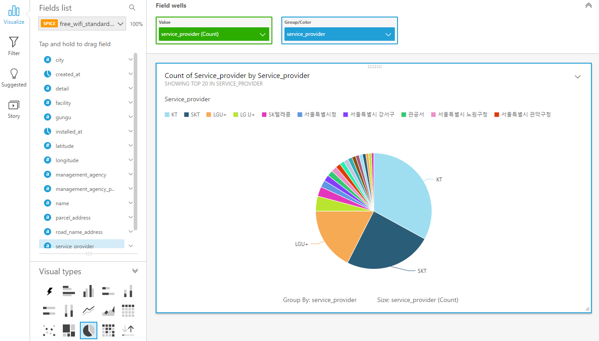

# 공공데이터를 이용한 데이터 만들기부터 분석까지
---

## 개요
빅데이터를 직접 모으는 방법이 있지만, [공공데이터 포털](https://www.data.go.kr/)과 [네이버 데이터랩](http://datalab.naver.com/)처럼
정해진 API를 통해 접근하거나 데이터를 JSON, XML, CSV와 같은 형식으로 지원해주는 사이트들을 적극 활용해볼 수 있다.

이번에는 [공공데이터 포털](https://www.data.go.kr/)에서 예제를 통해 전국무료와이파이 표준데이터에 대해서 AWS Athena로 쿼리하는 것을 진행한다.
또한, 결과에 대해 BI도구인 AWS QuickSight로 시각화해서 확인한다.

## 서비스 소개

- AWS Athena
  - 표준 SQL을 사용해 Amazon S3에 저장된 데이터를 간편하게 분석할 수 있는 대화식 쿼리 서비스
  - 서버리스 서비스이므로 관리할 인프라가 없으며 실행한 쿼리에 대해서만 과금
  - Amazon S3에 저장된 데이터를 지정하고 스키마를 정의한 후 표준 SQL을 사용하여 쿼리
  - Athena에서는 데이터 분석을 준비하기 위한 복잡한 ETL(Extract, transform, load) 작업이 필요없음
  - ANSI SQL을 지원하는 [Presto](https://prestodb.io/)를 사용하며, CSV, JSON, ORC, Avro, Parquet 등 표준 데이터 형식과 호환됨
- AWS QuickSight
  - BI 도구
  - 데이터 소스 접근
    - 기존의 Redshift, RDS, Amazon Aurora, EMR, DynamoDB, Kinesis, S3 및 기존 파일도 가능하며 Salesforce 같은 서드파티에 저장된 데이터 접근 커넥터도 제공
  - 빠른 데이터 연산
    - 고속의 병렬 인메모리 최적화된 연산 엔진(Super-fast, Parallel, In-memory optimized Calculation Engine, SPICE)을 가지고 있으며, 클라우드 기반으로 더 빠른 상호 작용 기반으로 데이터 시각화를 위한 사용자 경험을 제공
  - 손 쉬운 사용법
    - AWS 데이터 소스를 자동으로 발견하고 손쉽게 연결
    - 테이블 및 항목을 선택하면 최적의 데이터 그래프 형태와 시각화 방법을 제공
    - 이렇게 만들어진 리포트를 친구들에게 공유하거나, 몇몇 다른 리포트와 합쳐서 데이터가 말하는 바를 전달 할 수 있으며, 웹사이트에 임베딩해서 출력 가능
  - 높은 확장성 지원 
    - 빠른 분석 및 시각화를 제공하는 데, 이를 위해 수백 및 수천 사용자와 기관별로 테라바이트 급 데이터를 높은 확장성을 기반으로 처리
  - 저비용 구조
    - 기존 온프레미스 환경의 1/10 비용 만으로 스마트한 BI를 구성
  - 파트너 지원
    - ODBC 커넥터를 지원하여 파트너사의 기존 BI 도구를 연결 가능
    - SQL을 통해 SPICE 엔진이 기존 도구를 지원할 수 있으며, Domo, Qlik, Tableau 및 Tibo 같은 파트너와 협력
  

## 공공데이터 포털에서 데이터 가져오기

공공데이터포털에 계정이 있다면 [전국무료와이파이 표준데이터](https://www.data.go.kr/dataset/15013116/standard.do)에서 CSV파일을 다운받고,
자신의 Bucket에 업로드하면 된다.

없다면 아래와 같은 명령어로 자신의 S3 bucket에 복사해와야 한다.

```bash
$ aws s3 cp s3://awskrug-workshop-publicdata s3://<USER_BUCKET_NAME> --recursive
```

버킷을 확인하면 아래와 같은 두 파일이 있을 것이다.

- 전국무료와이파이표준데이터.xls
- csv/전국무료와이파이표준데이터.csv

우리는 CSV파일을 통해 Athena로 쿼리를 던져 결과를 받아볼 것이다.


## Athena에서 테이블 생성하기
(여기서부터는 N.virginia 리전에서 진행 필수)

Athena에서 S3저장소에 있는 CSV파일에 대해서 쿼리하기 위해서는 파일 형식에 대해 Athena가 이해하고 있어야 가능하다.

이를 위해서는 DBMS처럼 Athena에 database를 생성하고 table을 생성해야 한다.

Query Editor 항목에서 아래와 같은 쿼리를 입력하고 Run query를 한다.

```sql
# awskrug라는 database 생성
CREATE DATABASE IF NOT EXISTS awskrug
```

database를 생성하였다. 다음은 Athena가 이해할 수 있도록 CSV파일의 따른 table을 생성해주어야 한다.

```sql
# Catalog Manager로 생성
CREATE EXTERNAL TABLE IF NOT EXISTS awskrug.free_wifi_standard_data (
  `name` string,
  `detail` string,
  `city` string,
  `gungu` string,
  `facility` string,
  `service_provider` string,
  `wifi_ssid` string,
  `installed_at` DATE,
  `road_name_address` string,
  `parcel_address` string,
  `management_agency` string,
  `management_agency_phone` string,
  `latitude` float,
  `longitude` float,
  `created_at` DATE
)
ROW FORMAT SERDE 'org.apache.hadoop.hive.serde2.lazy.LazySimpleSerDe'
WITH SERDEPROPERTIES (
  'serialization.format' = ',',
  'field.delim' = ',',
  "serialization.encoding"='utf-8'
) LOCATION 's3://<USER_BUCKET_NAME>/csv/'
TBLPROPERTIES ('has_encrypted_data'='false');
```

제대로 생성했다면 아래와 같은 쿼리를 실행했을 때 결과가 나와야 한다.

```sql
SELECT * FROM awskrug.free_wifi_standard_data LIMIT 100;
```

## QuickSight - Athena 로 확인하기

1. QuickSight 열기
2. Manage Data 클릭
3. New Data Set 클릭
4. Athena를 데이터 소스로 선택
5. 데이터 소스명을 입력 awskrug
6. Create Data Source 클릭
7. awskrug database 를 선택
8. free_wifi_standard_data 테이블 선택

### 실행 결과
|   ||
|---|---|
| - 시도별 와이파이 설치| - 시도별 와이파이 서비스 제공업체|

상단의 Capture 버튼을 동해 스토리를 생성할 수 있다.

## QuickSight - uploaded file 로 확인하기

2. Manage Data 클릭
3. New Data Set 클릭
4. Upload a file 클릭
5. S3에 있는 CSV파일 다운로드 후 QuickSight에 업로드
6. 데이터 소스명을 입력 awskrug-upload
6. Create Data Source 클릭
7. Create Analysis로 전국무료와이파이표준데이터.csv 생성

이전과 같은 과정 반복하여 결과 확인

## 고찰
- Athena & 공공데이터 포털
  - 인코딩 문제
    - 공공데이터 포털에서 제공해주는 CSV파일이 EUC-KR로 되어 있었음
    - 별도로 EUC-KR에서 UTF-8로 수정하여 해결
    - 변환작업하는 OS가 Window일 경우 줄 시퀀스가 CRLF로 되어 있다면 LF로 바꾸어 저장할 것(Linux기반 OS와 Windows의 줄바꿈의 기준이 다르기 때문)
  - 공공데이터 포털의 대부분은 XML형식으로 이루어져 있기 때문에 만약 XML의 파일을 사용한다면 별도로 데이터 변환작업이 필요함
    - Python: [https://github.com/hay/xml2json](https://github.com/hay/xml2json)
    - Javascript: [https://github.com/Leonidas-from-XIV/node-xml2js](https://github.com/Leonidas-from-XIV/node-xml2js)
  - 공공데이터 포털의 데이터는 각 시군구 데이터의 형식이 다를 경우도 있기 때문에 전국적인 데이터로 사용하기 위해서는 전처리 작업이 필요함
- QuickSight
  - QuickSight 계정에서 Account Setting > Account Permissions > Edit AWS permissions에서 문제가 발생했을 경우
    - AWS IAM에서 이전에 생성된 IAM Role 및 policy(QuickSight로 검색)을 삭제해주면 정상적으로 다시 권한을 부여할 수 있음
  - 장점
    - 별도로 BI툴을 운영하거나 관리할 필요가 없음
    - 튜토리얼만 따라한다면 진입장벽이 높지 않음
    - Filter 기능을 통해 다양한 쿼리를 시각적으로 구현할 수 있음
    - 스토리로 저장할 수 있기 때문에 차트 관리에 유리
  - 단점
    - 한글화된 문서가 거의 존재하지 않음
    - 실제로 기업에서 사용한 사례가 많지 않기 때문에 도입하기가 쉽지 않음(보통은 Excel을 선호하기 때문에)
    - Suggested를 보면 추천되는 모형이 있지만 정규화가 제대로 되어있지 않은 데이터에 대해서는 쓸모가 없음(별도로 필터링이 필요)

- Cross-Region
  - S3-Athena는 다른 리전간에도 사용 가능. (현재 서울리전에서 가장 가까운 곳은 도쿄리전)
  - Athena-Quicksight는 같은 리전에서만 사용 가능.
  
  
## 사례 모음
- Athena
  - [https://aws.amazon.com/ko/blogs/korea/category/amazon-athena/](https://aws.amazon.com/ko/blogs/korea/category/amazon-athena/)
  - [https://aws.amazon.com/ko/blogs/korea/top-10-performance-tuning-tips-for-amazon-athena/](https://aws.amazon.com/ko/blogs/korea/top-10-performance-tuning-tips-for-amazon-athena/)

## 샘플
- Athena
  - [https://github.com/awskrug/athena-workshop](https://github.com/awskrug/athena-workshop)
- QuickSight
  - [https://aws.amazon.com/ko/blogs/aws/category/amazon-quicksight/](https://aws.amazon.com/ko/blogs/aws/category/amazon-quicksight/)


## References
- [https://prestodb.io/](https://prestodb.io/)
- [http://docs.aws.amazon.com/athena/latest/ug/json.html](http://docs.aws.amazon.com/athena/latest/ug/json.html)
- [https://aws.amazon.com/ko/blogs/korea/amazon-quicksight-fast-easy-to-use-business-intelligence-for-big-data-at-110th-the-cost-of-traditional-solutions/](https://aws.amazon.com/ko/blogs/korea/amazon-quicksight-fast-easy-to-use-business-intelligence-for-big-data-at-110th-the-cost-of-traditional-solutions/)
- [https://www.slideshare.net/awskorea/6-aws-bigdata-architecture-pattern-and-good-cases](https://www.slideshare.net/awskorea/6-aws-bigdata-architecture-pattern-and-good-cases)
