# AWS 기반 지속 가능한 데이터  분석하기

## 목차
- S3 + Glue를 이용하여 Datalake 구성하기
- EMR + Zeppelin을 통한 데이터 분석
- Tableau로 시각화 하기

## 개요
불과 수년전이지만 과거에는 빅데이터를 분석하는 것을 시도하는 자체가 어려운 일이었습니다. 데이터를 분석해서 의미를 도출해내는 작업 이전에 데이터 만지는데 전전긍긍하고 많은 시간을 쏟았습니다.

많이 들어보셨겠지만 하둡이나 스파크 같은 분산 프레임워크가 등장해서 이런 문제들을 해결해주었지만, 이것들을 셋업하고 운영하기에는 많은 시간과 노력이 필요했습니다. 다행히 Amazon EMR 같은 서비스가 등장하면서 이런 과정들을 간소화하고, 다른 리소스들과의 확장성을 갖춘 관리 형태로 제공하기 때문에 얼마든지 자신의 입맛에 맞는 분석 플랫폼을 구축할 수 있게 되었습니다.

이번 핸즈온을 통해 여러분들의 데이터를 Amazon EMR, Amazone S3 같은 서비스로 데이터 분석 아키텍쳐를 직접 구성해보고, 실제 업무에서 데이터 분석 업무가 어떻게 이뤄지는지 예제를 통해서 알아보겠습니다.

## 서비스소개
이번 핸즈온에서 사용하는 서비스들의 간략한 소개입니다.

### [Amazon S3](https://aws.amazon.com/ko/s3/)
Amazon S3는 업계 최고의 확장성과 데이터 가용성 및 보안과 성능을 제공하는 객체 스토리지 서비스입니다. 즉, 어떤 규모 어떤 산업의 고객이든 이 서비스를 사용하여 웹 사이트, 모바일 애플리케이션, 백업 및 복원, 아카이브, 엔터프라이즈 애플리케이션, IoT 디바이스, 빅 데이터 분석 등과 같은 다양한 사용 사례에서 원하는 만큼의 데이터를 저장하고 보호할 수 있습니다. Amazon S3는 사용하기 쉬운 관리 기능을 제공하므로 특정 비즈니스, 조직 및 규정 준수 요구 사항에 따라 데이터를 조직화하고 세부적인 액세스 제어를 구성할 수 있습니다. Amazon S3는 99.999999999%의 내구성을 제공하도록 설계되었으며, 전 세계 기업의 수백만 애플리케이션을 위한 데이터를 저장합니다.
### [AWS Glue](https://aws.amazon.com/ko/glue/)
AWS Glue는 고객이 분석을 위해 손쉽게 데이터를 준비하고 로드할 수 있게 지원하는 완전관리형 ETL(추출, 변환 및 로드) 서비스입니다. AWS Management Console에서 클릭 몇 번으로 ETL 작업을 생성하고 실행할 수 있습니다. AWS Glue가 AWS에 저장된 데이터를 가리키도록 하기만 하면, AWS Glue에서 데이터를 검색하고 관련 메타데이터(예: 테이블 정의, 스키마)를 AWS Glue 데이터 카탈로그에 저장합니다. 카탈로그에 저장되면, 데이터는 즉시 검색하고 쿼리하고 ETL에서 사용할 수 있는 상태가 됩니다.
### [Amazon EMR](https://aws.amazon.com/ko/emr/)
Amazon EMR은 관리형 하둡 프레임워크로서 동적으로 확장 가능한 Amazon EC2 인스턴스 전체에서 대량의 데이터를 쉽고 빠르며 비용 효율적으로 처리할 수 있습니다. 또한, EMR에서 Apache Spark, HBase, Presto 및 Flink와 같이 널리 사용되는 분산 프레임워크를 실행하고, Amazon S3 및 Amazon DynamoDB와 같은 다른 AWS 데이터 스토어의 데이터와 상호 작용할 수 있습니다. 널리 사용되는 Jupyter Notebook에 기반한 EMR Notebooks는 임시 쿼리 및 탐색 분석을 위한 개발 및 협업 환경을 제공합니다. EMR은 로그 분석, 웹 인덱싱, 데이터 변환(ETL), 기계 학습, 금융 분석, 과학적 시뮬레이션 및 생물 정보학을 비롯하여 광범위한 빅 데이터 사용 사례를 안전하고 안정적으로 처리합니다.
### [Amazon Athena](https://aws.amazon.com/ko/athena/)
Amazon Athena는 표준 SQL을 사용해 Amazon S3에 저장된 데이터를 간편하게 분석할 수 있는 대화식 쿼리 서비스입니다. Athena는 서버리스 서비스이므로 관리할 인프라가 없으며 실행한 쿼리에 대해서만 비용을 지불하면 됩니다.
### [Tableau](https://www.tableau.com/ko-kr)
Tableau는 데이터를 분석하고 시각화해주는 엔드투엔드 BI Tool입니다. Amazon의 데이터 원본(Amazon Redshift, Amazon Aurora, Amazon Athena, Amazon EMR 등)에 직접 연결을 지원합니다.

## EMR을 통해 분석환경 구축하기
시작하기에 앞서서 생성한 EMR 클러스터에 ssh 접속을 위해 EC2키페어를 생성합니다.
  - EC2 콘솔메뉴로 이동 (https://ap-northeast-2.console.aws.amazon.com/ec2/v2/home?region=ap-northeast-2)
  - *키페어* 메뉴에 *키페어 생성* 버튼을 눌러서 키페어를 생성합니다. 키페어 생성 즉시 브라우저에서 .pem 파일 하나가 다운로드 됩니다.

```
키페어 이름 :        ds-handson-20190509
```

  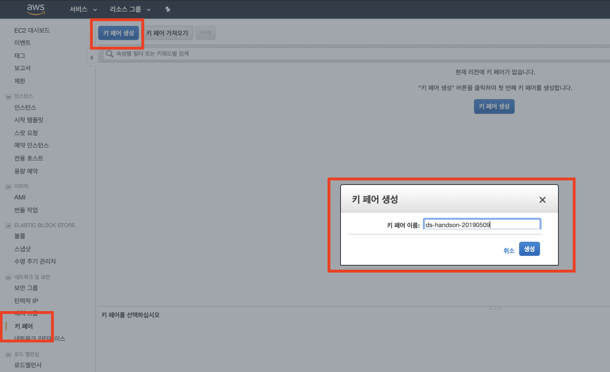
  
  - 윈도우사용자는 Putty등을 이용하여 SSH 접속이 가능합니다.

  https://docs.aws.amazon.com/ko_kr/AWSEC2/latest/UserGuide/putty.html
  
  - MAC사용자는 키파일을 사용하기 위해 아래 명령어로 pem 파일에 권한을 변경합니다.
  
  ```
  chmod 400 ds-handson-20190509.pem
  ```

  - pem키는 사용후 꼭 지우시거나 관리해주세요. git에 올리시면 안됩니다!

### 1. EMR 시작하기
- 콘솔에서 EMR 서비스로 이동합니다.
- 이전에 EMR 서비스를 사용해보시지 않으셨다면 아래와 같은 화면을 볼 수 있습니다.

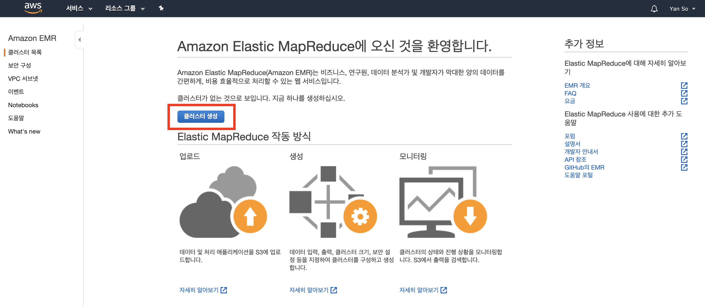

- *클러스터 생성* 버튼을 눌러 EMR을 생성해보겠습니다.
- EMR 클러스터 생성을 위한 환경설정 메뉴를 확인하실 수 있습니다.
  - 빅데이터 분석을 위해서 어떤 소프트웨어를 사용할 것인지 선택할 수 있습니다.
  - *데이터 메터 데이터에서 AWS Glue 데이터 카탈로그 사용* 이란 옵션이 있는데 추후에 Glue를 통해 생성한 데이터 카탈로그의 데이터들에 접근할 수 있습니다.
  - 하드웨어를 선택할 수 있습니다. 선택하시는 인스턴스에 따라 퍼포먼스와 비용에 영향을 줍니다.
  - 또한 좌측 상단에 보시면 *고급 옵션으로 이동*이란 메뉴가 있어서 원하시는 환경을 직접 선택하여 구성하실 수 있습니다.
  - *고급 옵션으로 이동*을 선택합니다.

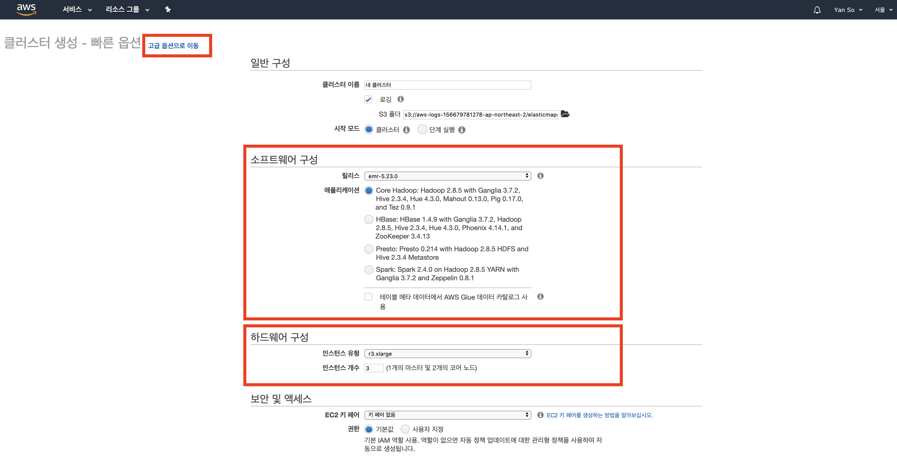

### 2. EMR 구성하기
- 소프트웨어 구성을 위한 화면입니다. 이전에 보았던 메뉴구성과 달리 원하시는 소프트웨어의 조합을 마음대로 구성하실 수 있습니다.
- Zeppelin과 Spark 환경을 구성하기 위해 *Hadoop 2.8.5, Zeppelin 0.8.1, Spark 2.4.0*을 선택하였습니다.
- AWS Glue 데이터 카탈로그 설정도 체크하였습니다.

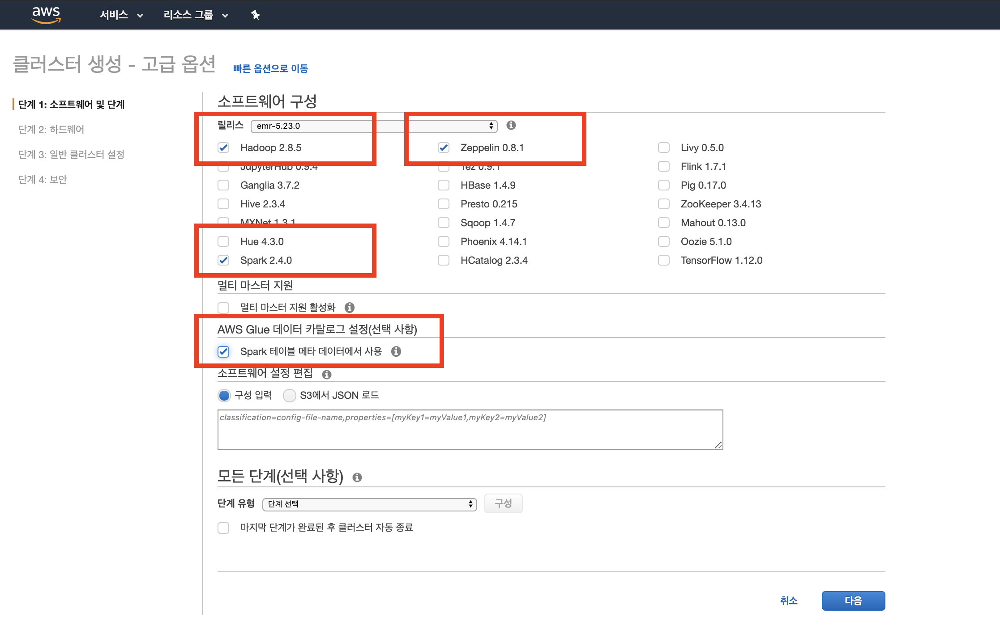

- 하드웨어 구성은 마스터노드 1개는 온디맨드 형태로, 코어노드 5개는 스팟 형태로 띄워보겠습니다.
- 마스터노드에는 Zeppelin을 포함한 여러가지 환경설정들이 저장되어 있어서, 마스터노드가 꺼질경우 전체 분석환경이 비활성화 된다고 생각하시면 됩니다. 반면에 실제 데이터들을 분산하여 처리하는 코어노드나 작업노드는 원하는 작업양 만큼 자유롭게 늘이고 줄이고하는 작업이 가능합니다.
- 코어노드나 작업노드는 비용을 고려하여 스팟 인스턴스 형태로 띄워도 무방합니다. 마스터노드도 스팟인스턴스로 띄워도 되긴 하지만 설명드린 것 처럼 마스터노드에 문제가 생기면 많은 귀찮고 어려운점들이 있으니 온디맨드로 사용하는 것을 권장합니다.

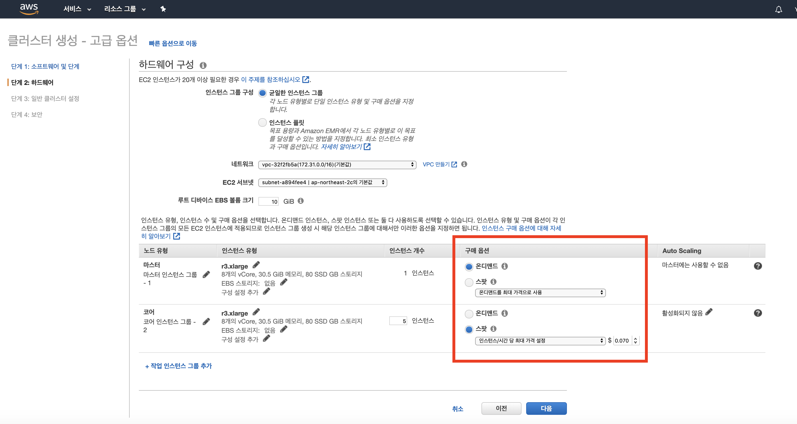

- 클러스터 이름을 입력하고 다음으로 넘어갑니다.

```
클러스터 이름 :        ds-handson-20190509
```

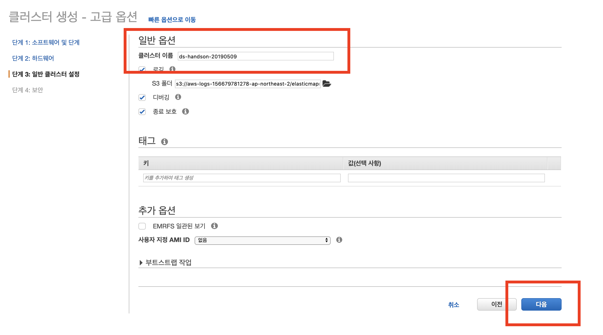

- 마지막 보안을 위한 설정입니다. 최초에 생성한 키페어를 선택하고 *클러스터 생성* 버튼을 누릅니다.
- 생성완료까지 수분이 소요됩니다.


- EMR 클러스터 생성이 완료되면 아래와 같은 화면을 보실 수 있습니다.
- *마스터 퍼블릭 DNS*는 Zeppelin이나 ssh 접속 시 사용할 수 있습니다.
- *ElasticMapReduce-master 보안그룹*에서 보안그룹을 설정하여 접근권한을 제어할 수 있는데, 실습을 위해 현재 IP 기준으로 접근을 허가하도록 하겠습니다.

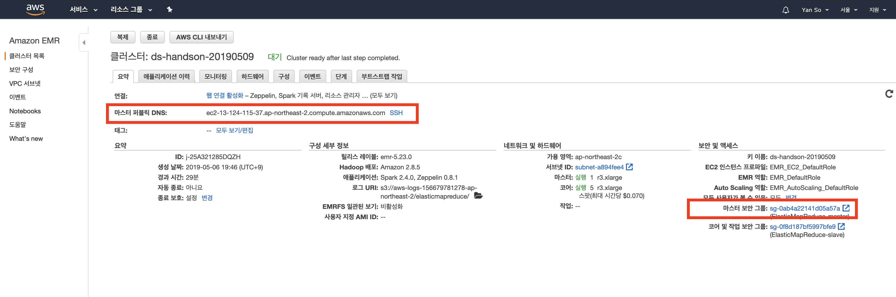

- *ElasticMapReduce-master*을 클릭하면 EC2 콘솔 보안 그룹 메뉴로 이동합니다.
- ElasticMapReduce-master 보안그룹의 인바운드을 편집합니다.

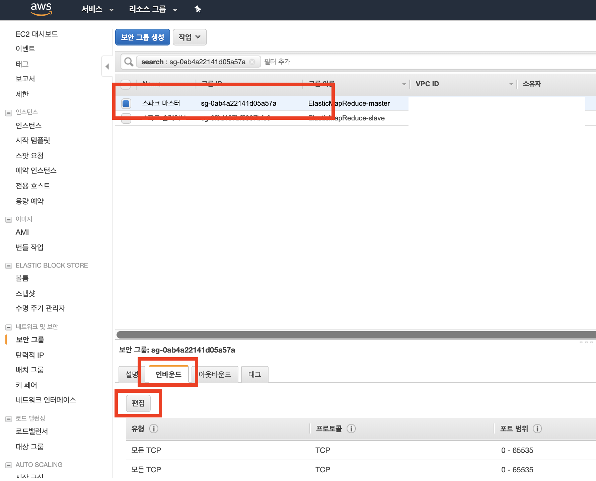

- 8890 포트 (Zeppelin 사용) 22 포트 (ssh 접속)을 사용하는 접근 가능한 소스에 *접속하는 PC의 Public IP*를 추가합니다.
- 접속하는 PC의 Public IP는 http://www.findip.kr 등을 사용하면 쉽게 알 수 있습니다.

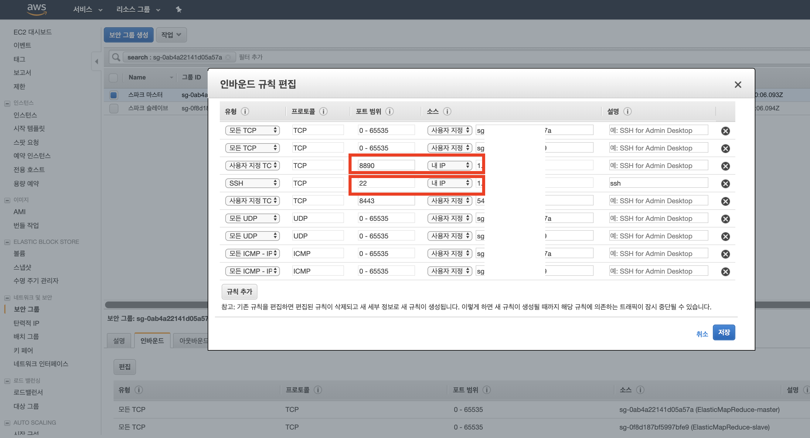

- 여기까지 모두 성공하셨다면 정상적으로 Spark 마스터노드 안에 구성된Zeppelin에 접근이 가능합니다.

```
접속URL: http://[생성된 마스터 퍼블릭 DNS]:8890
ex) http://ec2-**-***-***-**.ap-northeast-1.compute.amazonaws.com:8890
```

- 데이터를 Zeppelin을 통해 만지기 전에 간다한 설정들을 해두겠습니다. 
  - [간편 설정을 위한 쉘스크립트](https://github.com/awskrug/datascience-group/blob/master/workshop-sustainable_data_analysis/env_emr_spark_zeppelin.sh)를 Working Directory에 다운받습니다.
  - 윈도우 사용자:
  
  Putty로 MasterNode에 접속합니다.
  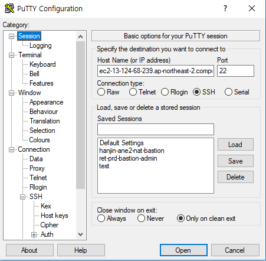
  ```
  Host Name :     마스터 퍼블릭 DNS
  Data - Auto-login username : hadoop
  SSH - Auth - Private key file for authentication :  ppk파일로 변환한 키페어파일(ds-handson-20190509.ppk)
  ```
  MasterNode에 접속하면 다음 명령어로 핸즈온에 사용할 쉘스크립트 파일을 다운로드합니다.
  ```
    wget https://raw.githubusercontent.com/awskrug/datascience-group/master/workshop-sustainable_data_analysis/env_emr_spark_zeppelin.sh
   ```

  - Mac사용자 : 
    - 설정에 필요한 명령어들 묶음인 쉘스크립트 파일을 업로드 합니다.
    


      ```
      mkdir ds_handson_20190509
      cd ./ds_handson_20190509
      scp -i [KEY_PAIR_PATH] ./env_emr_spark_zeppelin.sh hadoop@[MASTER_PUBLIC_DNS]:/home/hadoop/env_emr_spark_zeppelin.sh
      ```
    
    - 터미널에서 해당 마스터 노드에 ssh 접속합니다. 이전에 저장된 .pem 키를 사용합니다.
    
      ```
      ssh -i [KEY_PAIR_PATH] hadoop@[MASTER_PUBLIC_DNS]
      ```
    
    - ssh접속에 성공하였으면 아래 화면이 확인 가능합니다. ls 명령어를 통해 1번 과정에서 복사했던 쉘스크립트 파일이 확인 가능합니다.
    
  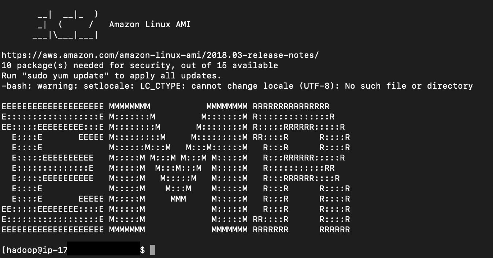
  
  - 쉘스크립트 실행합니다. Zeppelin ID는 ds_handson_20190509로 미리 설정했습니다. 쉘스크립트가 실행되면 Zeppelin 비번을 한번 입력해주셔야 합니다.

    ```
    sh env_emr_spark_zeppelin.sh
    ```
  
    설정 완료까지 수분이 소요됩니다.
  
- Zeppelin에 접속하여 id: ds_handson_20190509 pw: {입력하신 패스워드}로 접속이 정상적으로 되는지 확인합니다.
  
  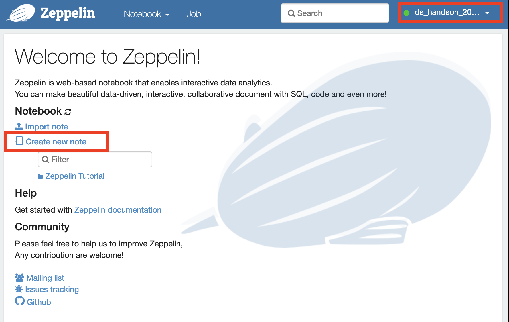

## 데이터셋 준비하기
핸즈온에 사용할 데이터는 [SKT Big Data Hub](https://www.bigdatahub.co.kr)에서 제공하는 배달업종 이용현황 분석 2018년 데이터입니다. 사이트에 가보시면 회원가입 후 직접 다운로드가 가능하며 공개된 다양한 종류의 데이터가 많으니 확인해보시기 바랍니다.

핸즈온 종료시점 이후 데이터를 github으로 변경하였습니다.
[데이터 다운로드](https://github.com/awskrug/datascience-group/tree/master/workshop-sustainable_data_analysis/data)ㅇ
위 링크에서 다운로드 후 압축을 해제하시면 csv파일이 나오는데, 해당 파일을 아래 경로에 업로드 해주세요.

*[your_id]-ds-handson-20190509*이라는 버켓을 생성하시고 original_data 폴더내에 업로드 해주세요.
업로드 위치: s3://[your_id]-ds-handson-20190509/original_data/

~~데이터는 미리 받아서 월별로 폴더트리를 만들어서 S3에 업로드 해두었습니다. EMR 마스터에 ssh 접속한 상태에서 아래 명령어를 통해서 여러분의 S3에 업로드하세요. EMR 마스터 인스터스에는 AWS CLI가 이미 셋업되어 있어서 바로 업로드가 가능합니다.~~

~~- Bucket 생성
aws s3 mb s3://[your_id]-ds-handson-20190509 --region ap-northeast-2

~~- 파일 업로드~~
~~aws s3 sync s3://data-ds-handson-20190509 s3://[your_id]-ds-handson-20190509/original_data --region ap-northeast-2~~

~~- 업로드 확인~~
~~aws s3 ls [your_id]-ds-handson-20190509/original_data/~~


~~위와 같이 *aws s3 ls* 명령어로 확인하거나 직접 S3 콘솔에서 파일이 업로드 되어있으면 준비가 완료 되었습니다.~~

## Zeppelin을 이용하여 데이터 전처리

데이터분석을 위해 EMR 설정도 완료했고, 데이터도 준비되었습니다. 이제 진짜로 데이터를 들여다보도록 하겠습니다. 핸즈온으로 준비한 데이터는 총 120mb 정도되는 작은 데이터이고 충분히 Google Spread Sheet 서비스나 엑셀로도 처리가 가능합니다. 이번 핸즈온에서는 실제로 빅데이터를 다루지는 않지만 어떻게 AWS 리소스를 이용하여 일반적인 워크스테이션이나 데이터베이스에서 처리할 수 없는 빅데이터를 분석할 수 있는지에 대한 접근방법을 익히는것이 중요한것임을 말씀드립니다. 

### 1. Zeppelin 시작하기
Zeppelin에 접속하여 노트북을 생성합니다.

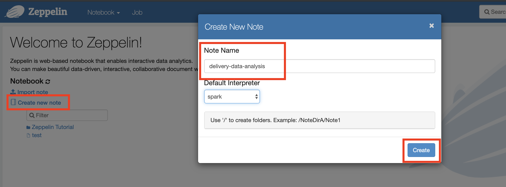

### 2. 데이터 불러오기 & 살펴보기
여기부터 진행되는 내용은 아래 코드블락을 Zeppelin 노트북에 복사&붙여넣기 해보시고 실행해보시면 됩니다.

- 자주쓰는 라이브러리 선언

  ```
  %pyspark

  from pyspark.sql.functions import *
  from pyspark.sql.types import *
  from pyspark.sql.window import Window
  import pandas as pd
  import numpy as np
  from urllib.parse import urlparse, parse_qs, unquote_plus, urlsplit
  from datetime import datetime, timedelta
  from dateutil.relativedelta import relativedelta
  import re
  import time
  import builtins
  ```

- S3 데이터 불러오기 (PySpark 이용)

  ```
  %pyspark

  dat = spark.read.csv("s3n://[your_id]-ds-handson-20190509/original_data/*", header = True)
  z.show(dat)
  ```
  
  
  
  요일별 분석을 위해 요일 정보가 있으면 좋겠습니다. [이 페이지](https://stackoverflow.com/questions/38928919/how-to-get-the-weekday-from-day-of-month-using-pyspark)를 참고하면 날짜에서 요일정보를 만들 수 있을 것 같습니다. 새로운 블록을 만들어서 아래와 같이 시도해봅니다.
  
  ```
  %pyspark
  
  dat = spark.read.csv("s3n://[your_id]-ds-handson-20190509/original_data/*", header = True)\
    .withColumn("dow_number", date_format('일자', 'u'))

  z.show(dat)
  ```
  
  새로 만든 "dayofweek" 열에 예상했던 요일정보가 없고 null 값으로 채워져 있습니다. 사용한 [date_format 관련 문서](https://spark.apache.org/docs/2.1.0/api/python/pyspark.sql.html)를 보면 입력값으로 date와 format을 받습니다. 저희가 넘겨준 '일자'칼럼을 date로 인식하지 못해서 발생한 문제인 것 같습니다.

  

### 3. 데이터 전처리

- '일자' 컬럼을 PySpark가 좋아하는 형태로 변환시킵니다. to_date 함수의 foramt 파라미터에 date 정보의 형태를 알려주면 date 형태로 정보를 올바르게 읽어옵니다.
- 그 후에 다시 date_format 함수를 이용하여 요일정보를 가져옵니다.

  ```
  %pyspark
  
  dat = spark.read.csv("s3n://[your_id]-ds-handson-20190509/original_data/*", header = True)\
    .withColumn("일자", to_date("일자", "yyyyMMdd"))\
    .withColumn("dow_number", date_format('일자', 'u'))\
    .withColumn("dow_string", date_format('일자', 'E'))
    
  z.show(dat)
  ```

  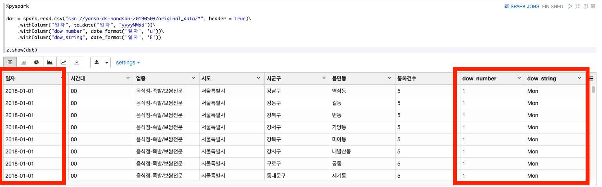

- 이와같이 Zeppelin을 통해 데이터 전처리가 가능하고 간단한 분석 및 시각화도 
가능합니다.

  ```
  %pyspark

  result = dat\
    .groupBy("dow_number", "dow_string")\
    .agg(sum("통화건수").alias("통화건수"))\
    .sort("dow_number")
    
  z.show(result)
  ```
  
  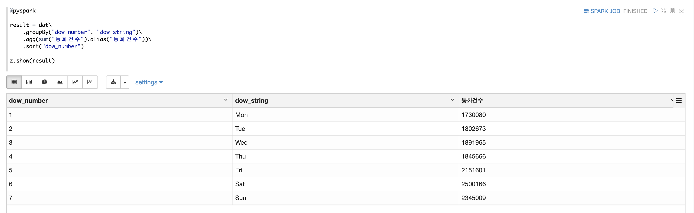
  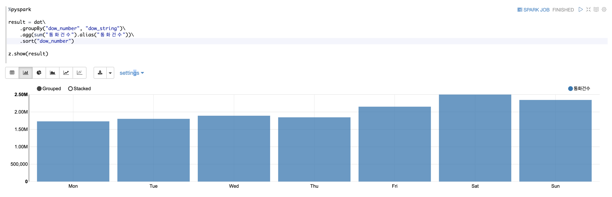

### 4. 전처리 데이터 저장하기

날짜포맷을 바꾸고 요일정보를 추가한 데이터를 다시 S3에 적재합니다. 기존에는 *[your_id]-ds-handson-20190509* 버켓의 origianl_data 폴더에 1년치 데이터가  저장되어 있었습니다. 크게 문제가 되지 않을 파일 사이즈이지만, 만약 일별/월별로 적재되는 데이터의 사이즈가 크고 오랜기간 동안 데이터가 누적되었다면 그 데이터를 조회하는데만 큰 비용이 발생합니다.

- 효율적인 데이터 관리와 파티션이라는 개념을 향후에 사용하기 위해 폴더트리를 월단위로 변경하여 저장하겠습니다.

  ```
  %pyspark

  start_date = "2018-01-01"

  for mm in range(0, 12):
    dt = datetime.strptime(start_date, '%Y-%m-%d') + relativedelta(months = mm)
    date_yyyy_mm = "{:%Y-%m}".format(dt)
    date_simple = "{:%Y-%m-%d}".format(dt)
    print(date_yyyy_mm)

    result = dat\
        .filter(col("일자").startswith(date_yyyy_mm))\
        .repartition(1)\
        .write\
        .csv("s3n://[your_id]-ds-handson-20190509/result/{}".format(date_yyyy_mm), header=True, mode="overwrite")
  ```

해당 버켓의 result 폴더에 가보면 의도한대로 데이터가 월별로 폴더링 되어 적재되어 있습니다.

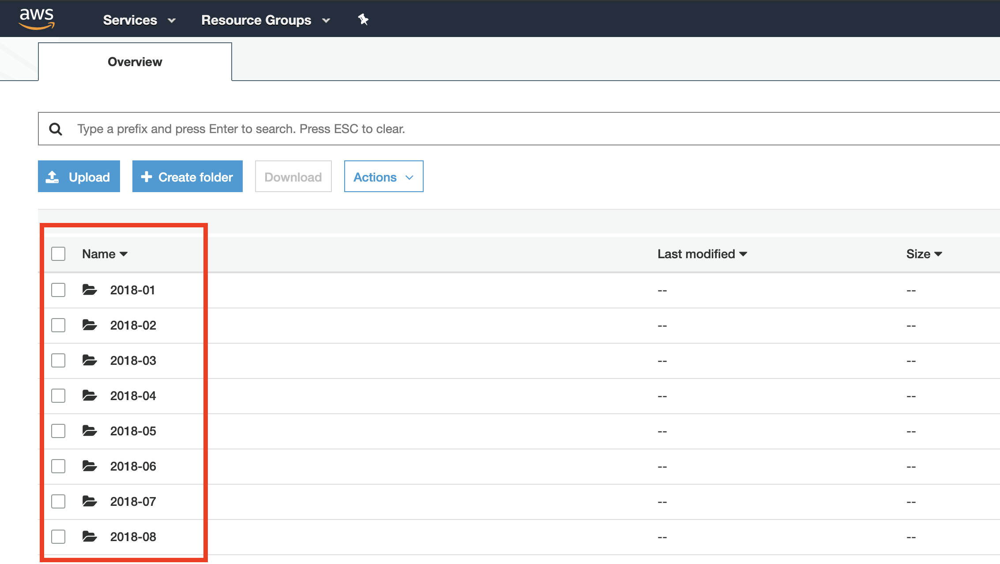

## AWS Glue를 이용하여 데이터 카탈로그 생성

이전 단계에서 했던 데이터 처리작업은 S3에 적재되어있는 데이터를 제가 원하는 형태로 가공해서 S3 다른위치에 다시 적재하는 과정이었습니다. S3는 사용성이나 비용측면에서 여러가지 장점을 가지고 있어서 실제로 업무를 하면서도 필요에 따라 많은 종류의 그리고 대용량의 처리를 S3에서 무리 없이 사용하고 있습니다. 작업이 진행될수록 데이터들이 S3내에서도 산재되어 있고, 또한 모든데이터들이 S3에 있는것이 아니라 RDS, DynamoDB 등등 여러 소스에 존재해서 통합 관리의 필요성이 생깁니다.

이를 위해 AWS Glue 서비스의 가장 강력한 기능인 크롤러를 통해 자동으로 데이터 카탈로그를 생성하는것을 만들어 보겠습니다.

[AWS Glue](https://ap-northeast-2.console.aws.amazon.com/glue) 콘솔화면으로 이동합니다.

### 데이터베이스 만들기

- 데이터베이스를 생성합니다. 이름은 *ds-handson-20190509*로 입력합니다.

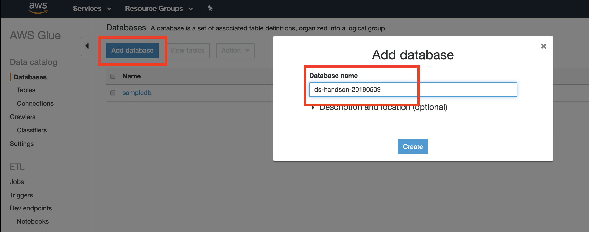

만들어진 데이터베이스 하위메뉴에 *테이블* 클릭해보면 아무런 테이블이 정의되어 있지 않다고 나옵니다. *테이블 추가* 메뉴로 수동으로 테이블을 입력할 수 있지만, 우리는 크롤러를 이용하여 자동으로 테이블을 생성하도록 하겠습니다. 왼쪽에 *크롤러* 메뉴로 이동합니다.

- *크롤러 추가* 버튼을 눌러 크롤러를 생성합니다.

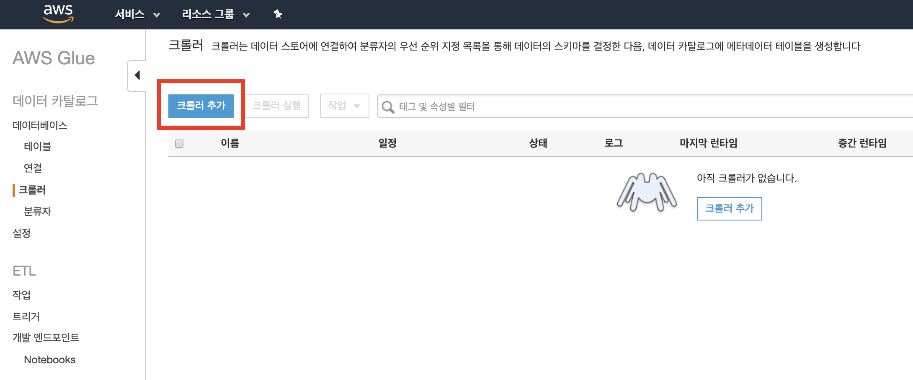

- 크롤러 이름을 입력합니다. *crawler-ds-handson-20190509*로 입력합니다.

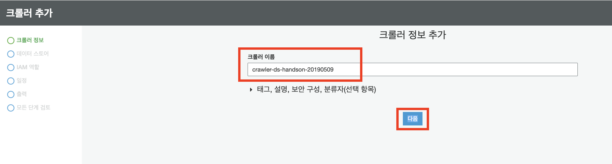

- 크롤링을 진행할 데이터소스를 지정합니다. 데이터 전처리 한 데이터를 S3에 적재해두었기 때문에 S3의 데이터를 데이터 소스로 사용하겠습니다. S3 경로를 입력 해 줍니다.
경로는 *s3://[your_id]-ds-handson-20190509/result* 입니다.

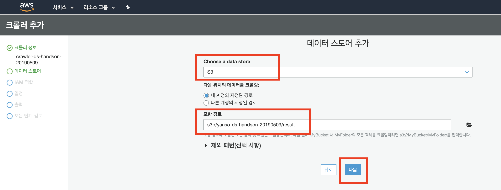

- 이번 핸즈온에서는 1개 데이터 소스를 이용하고 있지만, 데이터소스가 여러개인 경우 추가로 등록 해 주시면 됩니다.

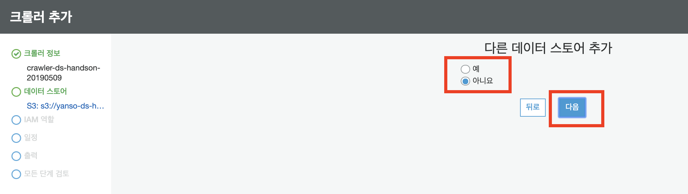

- 크롤러의 IAM 역할을 지정해줍니다. 역할을 직접 생성하셔서 필요한만큼의 권한을 부여하셔도 됩니다. 핸즈온을 위해서는 *기존 IAM권한을 선택*에서 *AWSGlueServiceRoleDefault*를 선택합니다.

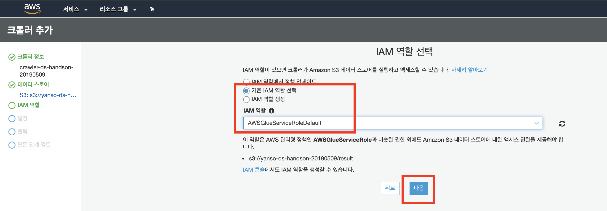

- 지금까지는 주기적으로 실행이 필요하지 않기 때문에 *온디맨드* 형태로 크롤러를 실행하겠습니다.

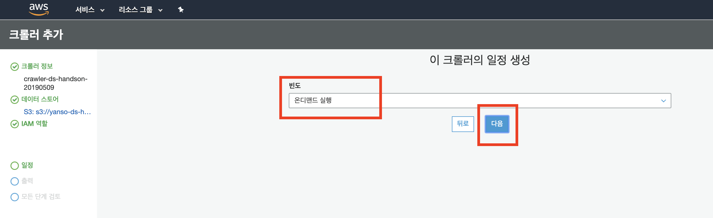

- 크롤링 결과는 테이블 형태로 출력을 하는데 해당 정보를 입력해줍니다. *ds-handson-20190509* 데이터베이스를 선택합니다. 테이블이 생성될 때 접두사를 붙일수도 있습니다.

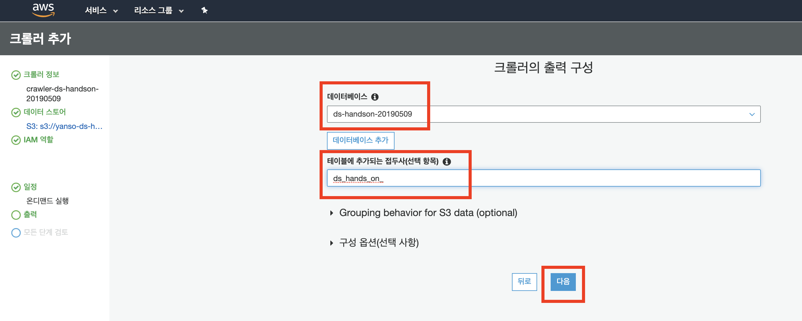

- 최종 정보를 확인하고 크롤러를 생성합니다.

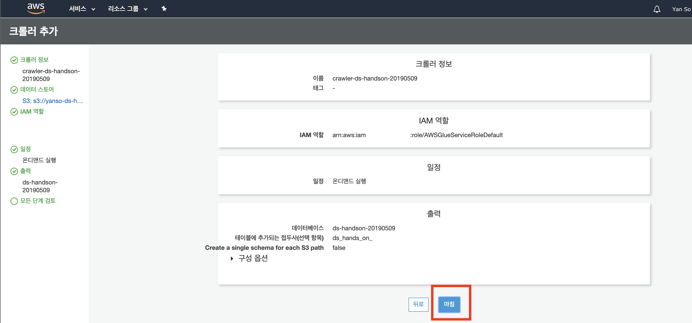

- 생성 된 크롤러를 실행합니다. 크롤러가 실행되면 완료까지 수분이 걸립니다.

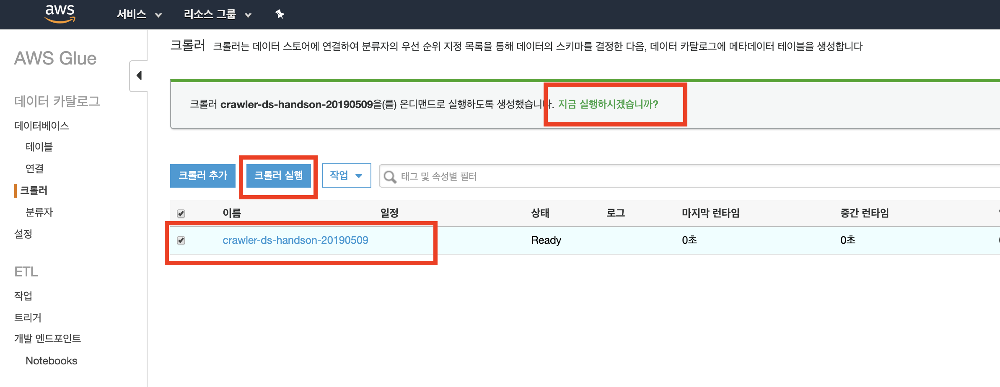

### 생성된 테이블 살펴보기

크롤러 작업이 완료되면 *테이블* 메뉴에서 생성된 테이블을 확인 가능합니다.

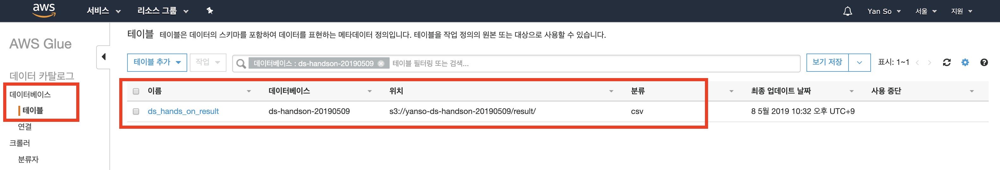

테이블 상세화면에 가보면 상단에 데이터 소스 위치정보가 가능하고 하단에는 데이터로부터 읽은 스키마정보를 자동으로 입력 된 것을 확인하실 수 있습니다. 스키마에 제일 마지막 *partion*가 추가됐고 해당 정보를 쿼리에 사용 할 수도 있습니다.

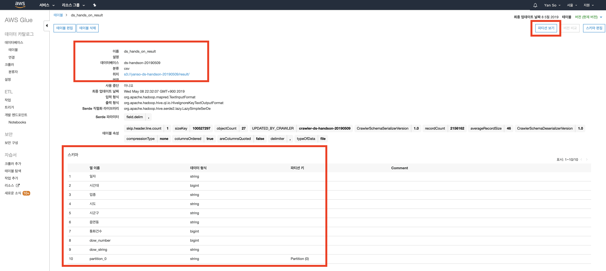

### Amazon Athena에서 카탈로그를 통해 데이터 불러오기

이렇게 생성된 데이터 카탈로그를 통해서 AWS 내부/외부 서비스에서 데이터를 쉽게 접근할 수 있게 됩니다. 서비리스 쿼리 서비스인 Amazon Athena를 통해서 S3에 있는 데이터를 카탈로그를 통해 조회해보도록 하겠습니다.

*테이블*에 *테이블 보기* 메뉴를 통해 Amazon Athena 서비스로 이동합니다.

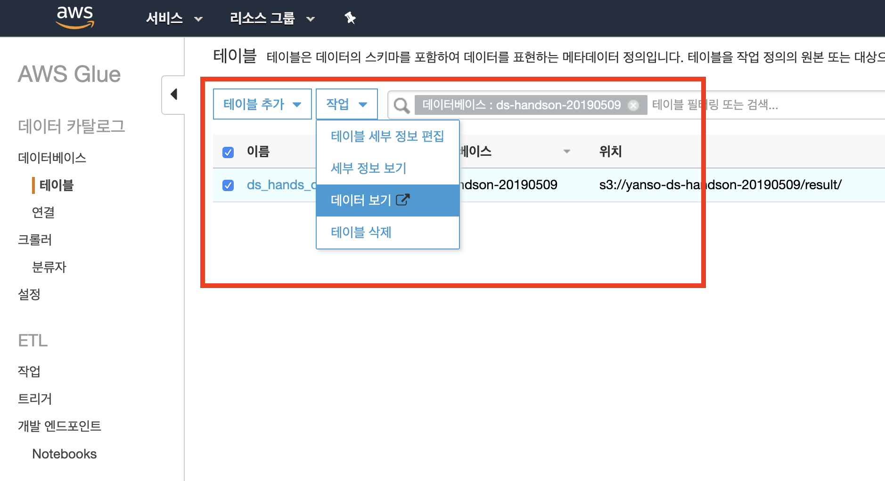

해당 데이터베이스와 테이블을 선택하면 SQL 쿼리로 데이터 조회가 가능합니다.

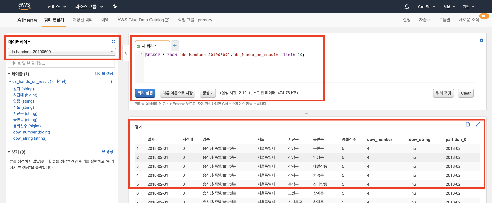

## Tableau를 이용하여 시각화하기

Amazon Glue를 통해 만들어진 데이터 카탈로그를 통해 외부 대시보드 툴인 Tableau에서도 데이터 조회 및 사용이 가능합니다. 이전에 전처리를 위해 Spark 엔진을 얹은 EMR을 띄워보았었는데요. 이번엔 Presto + EMR 옵션으로 하나 더 띄워보도록 하겠습니다.

### Presto + EMR 구성하기

이전에 EMR을 한번 구성해보았기 때문에 쉽게 하실 수 있으실겁니다. *소프트웨어 구성*에서 *Presto* 옵션을 선택하고 *테이블 메타 데이터에서 AWS Glue 데이터 카탈로그 사용*을 체크해줍니다.

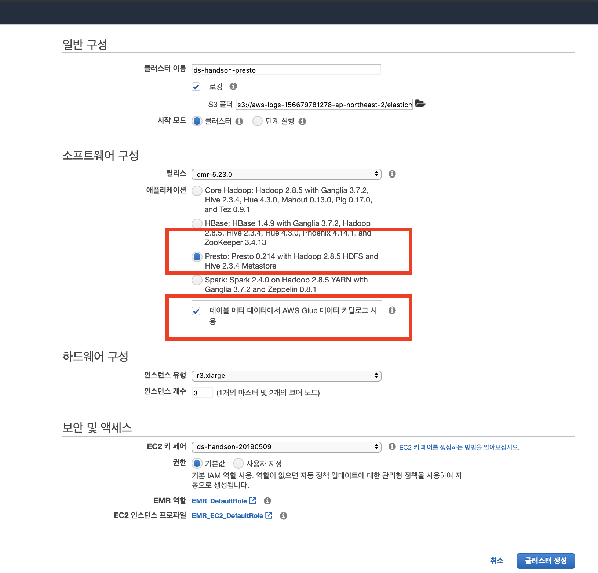

EMR에 셋업 된 Presto는 기본적으로 8889 포트를 사용합니다. 마스터노드의 보안규칙 인바운드에서 8889 포트를 열어줍니다.

### Tableau에서 데이터 카탈로그 조회하기

Tableau 메뉴에 데이터 연결에 보시면 Presto 메뉴가 있습니다. 해당 메뉴에서 EMR 마스터노드의 Public DNS를 입력해줍니다. 포트는 8889포트를 사용합니다.

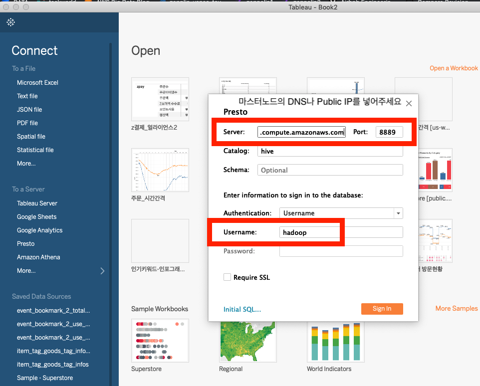

이전에 생성해 둔 데이터베이스와 테이블을 선택하면 Tableau에서 정상적으로 데이터가 불러와집니다.

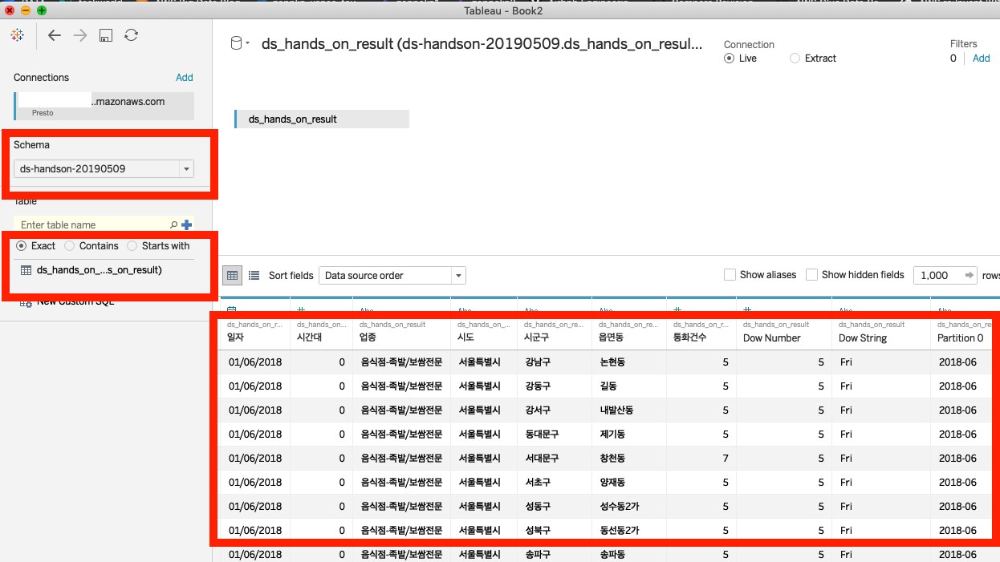

데이터가 정상적으로 확인되면 Tableau 기능을 이용해 데이터를 원하는 형태로 시각화를 해보시면 됩니다!

## 리소스 삭제
필요하신 경우가 아니라면 핸즈온을 마치시면 리소스 삭제 부탁드립니다. (비용 청구됨!)
리소스 삭제는 하신 작업의 역순으로 하시면 됩니다.

  - EMR + Presto 삭제
  - Glue 테이블, 크롤러 삭제
  - EMR + Spark 삭제

## 참고자료
AWS 기반 지속 가능한 데이터 분석 플랫폼 구축하기 (AWS Summit Seoul 2019)
: https://www.slideshare.net/awskorea/aws-aws-summit-seoul-2019-141290115
